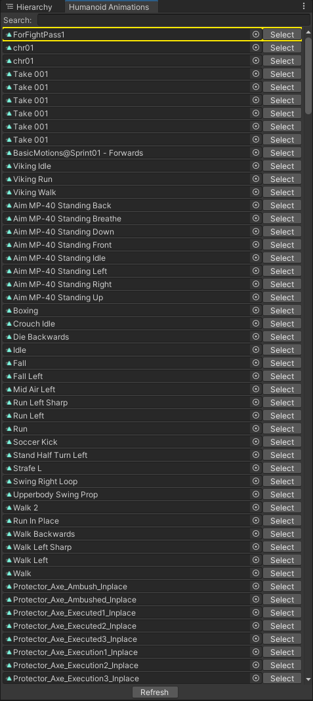

# unityFilmmakingHelpers
Small scripts/tools I use to help me make films in Unity
---------------------------------------------------------------
# HumanoidAnimationWindow

When working with a ton of humanoid animations the Unity workflow is slow and annoying. I've made feature requests for an animation
preview inside the animationClip selection window for years to no avail. This is the next best thing.

It takes a long time to load this window the first time as its indexing all your humanoid animations.

Use this window to search and preview your humanoid animations- when you've found the one you want you can drag/drop it from this
window into an animation field.

** add this animation autoplay script to your project for anim autoplay https://github.com/KuroiRoy/UnityAnimationPreviewAutoplay/tree/main

-----------------------------------------------------------------

* I'll clean up/document the other scripts soon- they are from the M doll interactive release https://store.steampowered.com/app/2105250/M_doll/
